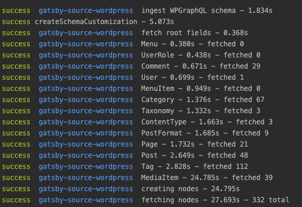
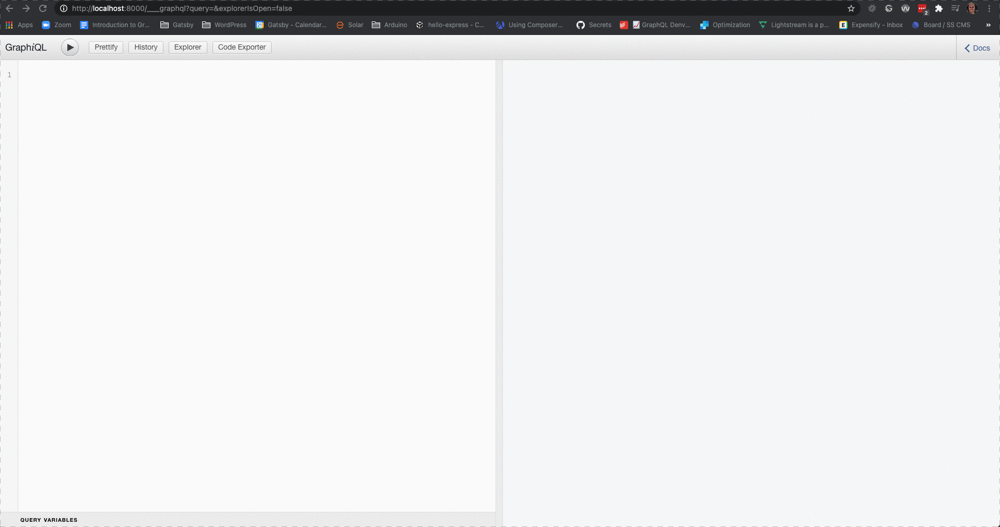
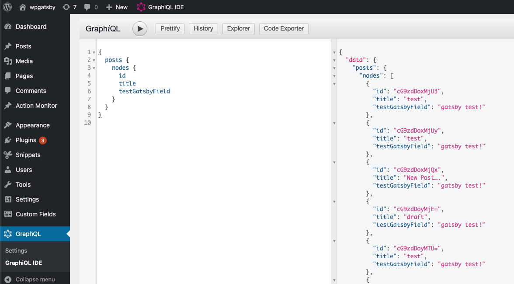
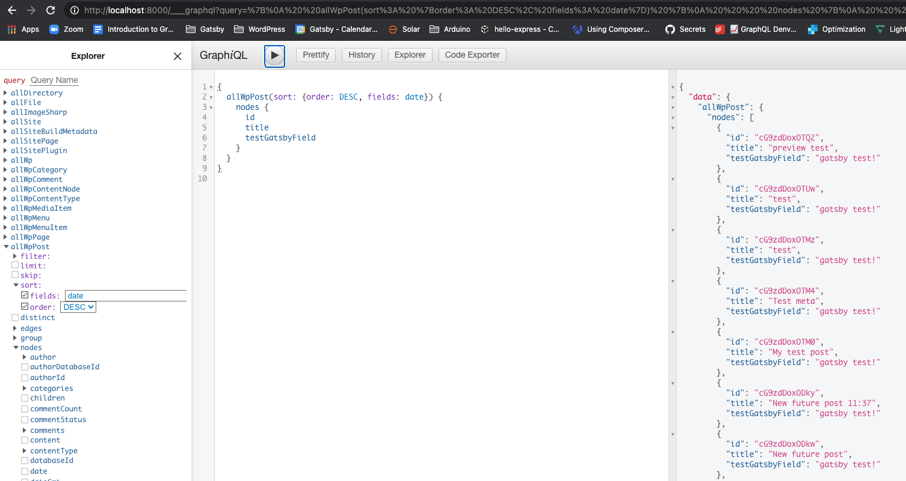

# GraphQL, WordPress and Gatsby

This document is intended to provide more information on how GraphQL to allow WordPress to be a
data source for Gatsby.

On this page, you will learn more about:

- How data flows from WordPress to Gatsby
- Differences between Gatsby's GraphQL API and WPGraphQL (GraphQL for WordPress)
- How WPGraphQL Extensions are Gatsby Extensions

## How Gatsby uses the WPGraphQL Schema

Schema Merging is the magic that makes this source plugin work!

The WPGraphQL and Gatsby GraphQL schemas are automagically merged behind the scenes for you by using
GraphQL introspection and logic that understands WPGraphQL and Gatsby.

When using Gatsby Source WordPress, Gatsby connects to your WordPress GraphQL endpoint, then uses
GraphQL Introspection queries to get a copy of your WordPress GraphQL Schema, then creates Types and
fields in Gatsby's GraphQL Schema that are very similar (but not identical) to the Types and Fields
in the WPGraphQL Schema.

The source plugin then generates GraphQL queries to fetch data (posts, pages, authors, media,
taxonomy terms, etc) from WordPress, based on your WordPress GraphQL Schema. These queries are sent
to your WordPress site's WPGraphQL endpoint, and then Gatsby caches (stores copies of the data) by
creating Gatsby nodes from the returned data. Data is never fetched twice. If we will already have
data, for example on a connection field between an Author and a Post, we only pull the id of the
Post and link the field to the Post node on the Gatsby side.



Once data is copied from WordPress into Gatsby's Node layer, it can be accessed using GraphQL
Queries against Gatsby's GraphQL API, and there are no additional network requests back to your
WordPress site.

## Gatsby's GraphQL API vs WPGraphQL

When querying data in Gatsby, you query from Gatsby's GraphQL API which reads from it's node store
(cached copies of WordPress data) and does not make network requests back to WordPress directly.

So, when using GraphQL queries to create pages or add data to pages in Gatsby, you query against
Gatsby's GraphQL API, and not WPGraphQL directly.

Gatsby's Schema for WordPress data looks similar to the Schema exposed by WPGraphQL, but with some
differences.

We'll cover some of these differences below.

### Schema Prefix

Gatsby Source WordPress prefixes Types from the WPGraphQL Schema with a `Wp` ([this can be changed](../plugin-options.md)).

This means that a GraphQL Type such as `Post` in WPGraphQL will be `WpPost` in Gatsby.

### Connection Names

Connections (lists of nodes) in Gatsby are pluralized with the word `all`. So instead of root fields
`post` and `posts` (in WPGraphQL), Gatsby has root fields `wpPost` and `allWpPost`.

A WPGraphQL Query for posts would look like:

```graphql
{
  posts {
    nodes {
      id
      title
    }
  }
}
```

But a similar query for posts in Gatsby might look like:

```graphql
{
  allWpPost {
    nodes {
      id
      title
    }
  }
}
```

### Children fields

In WPGraphQL some hierarchial data, such as Pages, have a `children` field. In Gatsby, this is
exposed as `wpChildren` instead of `children`.

### Filters & Inputs

Another important thing to note about the difference between WPGraphQL and Gatsby's GraphQL API, is
the input arguments.

WPGraphQL exposes input arguments that are sent to the WordPress server and can have an impact on
the results of a query.

When using Gatsby's GraphQL API, you're interacting with Gatsby's node layer, not WordPress directly,
so inputs that can be provided to fields in a WPGraphQL Query are not the same as the inputs that can
be provided in a Gatsby GraphQL Query.

For example, WPGraphQL provides a query for a single post that looks like the following:

```graphql
{
  post(id: 123, idType: DATABASE_ID) {
    id
    title
    content
  }
}
```

But a similar query for a single post by database ID in Gatsby would look like:

```graphql
{
  wpPost(databaseId: { eq: 1747 }) {
    id
    title
    content
  }
}
```

The differences in the WPGraphQL and Gatsby Schemas can be subtle, so it's advised to use tooling
such as GraphiQL to get familiar with both WPGraphQL and Gatsby's GraphQL Schemas.

### Understanding WordPress Data in Gatsby's GraphQL Schema

One of the best ways to explore the data that's available in Gatsby is to use GraphiQL. If you're
not yet familiar with GraphiQL, check out [this guide](https://www.gatsbyjs.com/docs/how-to/querying-data/running-queries-with-graphiql/).

Typing `Wp` (or the custom prefix your Gatsby site has configured) into the Docs explorer in GraphiQL
is one way to quickly begin exploring what GraphQL Types Gatsby Source WordPress has created in Gatsby's GraphQL Schema:



Also, using the GraphiQL Explorer to select fields is another good way to explore data that's made
available.


## WPGraphQL Extensions are Gatsby Extensions

Because of the way Gatsby Source WordPress uses WPGraphQL's Schema to fetch WordPress data and
customize Gatsby's Schema, it means that any WPGraphQL extension automatically works as a Gatsby
Source plugin.

If you use [WPGraphQL for Advanced Custom Fields](https://github.com/wp-graphql/wp-graphql-acf),
[WPGraphQL for Yoast SEO](https://wordpress.org/plugins/add-wpgraphql-seo/) or just about any other
[WPGraphQL Extension](https://www.wpgraphql.com/extensions/), then the data exposed by these plugins
will automatically be available for use in Gatsby.

To demonstrate this, we can register a new field to WPGraphQL with this PHP snippet (added to your
WordPress theme's functions.php or in a custom plugin).

```php
add_action('graphql_register_types', function() {
  register_graphql_field( 'Post', 'testGatsbyField', [
    'type' => 'String',
    'description' => __( 'Test field for demonstration', 'your-textdomain' ),
    'resolve' => function() {
      return 'gatsby test!';
    }
  ]);
});
```

This registers a field `testGatsbyField` to the WPGraphQL Schema, and always returns the value
`gatsby test!`.

Using GraphiQL within the WordPress dashboard, we can verify this new field exists on the Post type,
by querying like so:

```graphql
{
  posts {
    nodes {
      id
      title
      testGatsbyField
    }
  }
}
```



Now, we can also query this field from our Gatsby GraphQL API:

```graphql
{
  allWpPost {
    nodes {
      id
      title
      testGatsbyField
    }
  }
}
```



Pretty neat!

#### Caveats

Not all WPGraphQL Extensions are created equally. If a plugin exposes a scalar field on a Type, like
the example above, it will "just work" in Gatsby.

However, if your plugin is exposing more data than Scalar fields, such as Nodes and Connections, it
should follow the principles of the [GraphQL Relay spec](https://www.wpgraphql.com/docs/wpgraphql-concepts/#relay-specification) in order to really play nicely with Gatsby
Source WordPress.

Namely:

- Nodes should be accessible via RootQueries. For example, if you have a connection from Type A to
  Type B, and Type B is considered a Node, it should be able to be queried independently from the Root
  of the Graph as well as in connection to Type A.
- Hierarchical data should, when possible, be returned as a flat list (parent and children in the
  same level of the list) and should offer parentId / parentDatabaseId fields.

---

:point_left: [Back to Features](./index.md)
